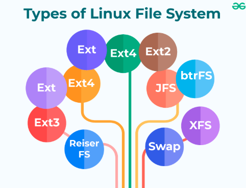

# Linux File System


- `Inode` is a data structure and it defines file or a directory on the filesystem
- `Inodes` point to blocks that makeup a file
- Linux File system [Refer here](https://www.geeksforgeeks.org/linux-file-system/)
Linux supports multiple filesystems, each designed for different use cases. Below are some of the most popular filesystems used in Linux environments.



##  EXT4 (Fourth Extended Filesystem)
- The default filesystem for most Linux distributions.
- Supports a **maximum filesystem size** of **1 Exabyte (EB)**.
- Supports **individual file sizes** up to **16 Terabytes (TB)**.
- Journaling support for improved data integrity.

## 📌 XFS (Extended File System)
- A **high-performance, journaling, 64-bit filesystem**.
- Supports **filesystem sizes** up to **8 Exbibytes (EiB) (~8 million TB)**.
- Supports **individual file sizes** up to **8 EiB**.
- Optimized for **parallel I/O operations**, making it ideal for large-scale storage.

## 📌 Btrfs (B-Tree Filesystem)
- A **next-generation Linux filesystem** with advanced features.
- Includes all the features of **EXT4**, plus:
  - **Dynamic inode allocation** and **transparent compression**.
  - **Online filesystem checking** for better integrity.
  - **Built-in RAID support**, including **mirroring and striping**.
  - **Snapshots and cloning support** for efficient backups and data versioning.

---
# Commands useful for storage  

## Disk Utilization:
- The du command allows you to determine disk utilization on a directory-by-directory basis
- For _du_ example [Refer here](https://www.redhat.com/en/blog/du-command-options)
- **-s, --summarize** display only a total for each argument
```sh
du -sh .
```

## Disk free:
- The df program displays the amount of free space available on the mounted file system.
- To show free space for all locally mounted drives use this command
```sh
sudo df -l
```

## To show the free space in human-readable format
```bash
sudo df -h
``` 

### If you specify a particular file, it will display the mount information for that specific file.  

For example:  
```bash
df <file name>

