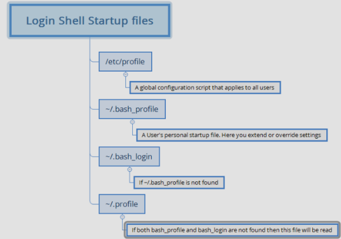
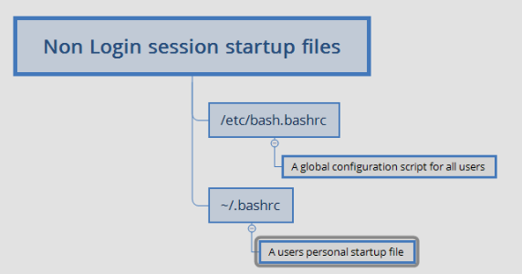

# Commands

* mkdir
* pwd
* cd
* ls = list the files in a directory or files
* touch = add files
* cat = display content
* rm = removes files
* rm * = removes all files in a folder
* rmdir = removes directory
* ls -al =  to show the permissions of the file
*  ` rwx rwx rwx `
fisrt coloumn is for `users` and second is for `groups` and third is for `others`.
* `cd ..` is for one step backward
* `cd ../..` is for two step backward
* cp = it is used for to copy file
* rm = to remove files
* man = used to display the user manual of any command that we can run on the terminal
* wget = is used for download
* curl = is used for transfer a url
* vi = text editor
* nano = text editor
* help = shows the detailed about command
* ls -l  = shows the long listing format of files and directories
* permissions of a file
    *  `r  w  x`
    *  `4  2  1 `
* r=read
* w=write
* x= execute
*in a file there wiil be users,groups,others
*to give only read and write to the users group, execute
                        ` chmod u+rw file name `
*to give all permissions to the users,groups.others then execute
                          ` chmod 777 filename `
  rwx            rwx           rwx
 users         groups      others  
----------------------------------------------------------------------------------------
*  to switch root user, execute 
    `sudo su - `
-------------------------------------------------------------------------------------------
* `sudo nano /etc/ssh/sshd_config`
* `sudo visudo`
 above two commands for password based authentication and adding sudoers file.
--------------------------------------------------------------------------------------------

 ` DISK ,TOP,HTOP,KIL `
-----------------------------------------

      ` ls -R or ls --recursive `
displays the contents of its subdirectories, and the contents of their subdirectories, and so on.
---------------------------------------------------------------------------------------------------
* if we install many versions ,to see those versions,select the particular one then,
     
    execute --->   "alternatives --config java"

     abova command displays the all versions of java installed in a  Virtual Machine 
-----------------------------------------------------------------------------------------------------
to know present VM pubblic ip address 
 ` curl ident.me`
-------------------------------------------------

adding a user to a group in Linux, we can use the usermod command.

     `sudo usermod -aG <group_name> <username>`
----------------------------------------------------------------------------

* All the commands in linux are case- sensitive.
----------------------------------------------------------------------------

In Linux, "lo" and "eth0" are two types of network interfaces, 
each serving a specific purpose.
  `lo-loopback`
  `eth0-ethernet0`
-----------------------------------------------------------------------------

In linux ,mounting known as mapping of hard disk from files 
  in linux  Virtual Machine is known as ,mounting.
-----------------------------------------------------------------------------
  ` cat /etc/passwd `

list linux users  
-----------------------------------------------------------------------------
to reeload the enviroment variables in in /etc/ directory

   `source /etc/environment`

  sorce is the command that reloads the enviromental variables.
-----------------------------------------------------------------------------

`Daemon Programs:`

* When a linux starts, kernel has to run some activites, so it initiates those activities as process and 
   launches a program called as _init_

---------------------------------

* process:

     * ps: Report the snapshot of current process
     * top: Display task
     * jobs: List active jobs
     * bg: Place the job in the background
     * fg: Place the job in the foreground
     * kill: Send a signal to a process
     * Killall: Kill a process by name
     * shutdown: Shutdown or reboot a system

* Every application(program) comes into execution through means of process, process is a running 
  instance of a program. Processes are created through different system calls, most popular are _fork()_ and _exec()_

* `fork()` - Creating a New Process
    * The `fork()` system call creates a new process by duplicating the existing process (parent process).
    * The new process, called the child process, gets a copy of the parent's memory, file descriptors,
        and execution state.
    * Both parent and child processes continue execution from the same point immediately after _fork()_.

* `exec()` -Replacing a Process Image
    * The `exec()` family of functions replaces the current process with a new program.

*  `fork()` and `exec()` Together

* `fork()` creates a child process.
* The child process calls `exec()` to run a new program.

* Flow Summary
   * You type: `ping google.com`
   * Shell forks a new process → Creates a child process (copy of the shell).
   * Child calls exec() → Replaces itself with the ping command.
   * Ping runs and sends ICMP packets to google.com.
   * When ping exits, the shell resumes control.

-----------------------------------     

## Signals

* Kill command syntax
  * `kill -signal PID`
  * IF no signal is specified then the `TERM (terminate)` signal is sent by default `15`

### Lets look at Common Signals

* HUP: Hang up. The signal number is `1`

* INT: Interrupt. This performs same functionas CTRL-C sent from terminal. It usally terminates the program . The signal number is `2`

* KILL: Kill. This signal is special because this signal will not reach process, kernel will terminate program immedietly, so no clean up oppurtunity given to your program. Signal number is `9`

* TERM: Terminate. This is default signal sent by kill. Signal number is `15`

* CONT: Continue. This will restore the process after STOP or TSTP signal. This signal is sent 
     by bg and fg commands. Signal number is `18`

* STOP: Stop. This signal causes a process to pause without terminating. Signal number is `19`

* TSTP: Terminal Stop. Signal number is `20`

---------------
## Env

#### Commands to View & Modify Environment:

* `printenv` – Displays environment variables.
* `set` – Shows all shell variables and functions.
* `export` – Makes a shell variable an environment variable.
* `alias` – Lists or defines command shortcuts.

* printenv command shows only environmental variables where set command displays both
   environment and shell variables

#### Data Stored in the Environment:

* Environment Variables: System-wide settings affecting processes.
* Shell Variables: Local to the shell session.
* Aliases: Custom command shortcuts.
* Shell Functions: User-defined reusable functions.

--------------

* The exact sequence of files depends on type of shell you have started. There are two types
    * Login shell session: This is the one in which we are prompted for username & password (ssh)
     

    * A non-login shell: This generally occurs when we launch a terminal in GUI.
      
      